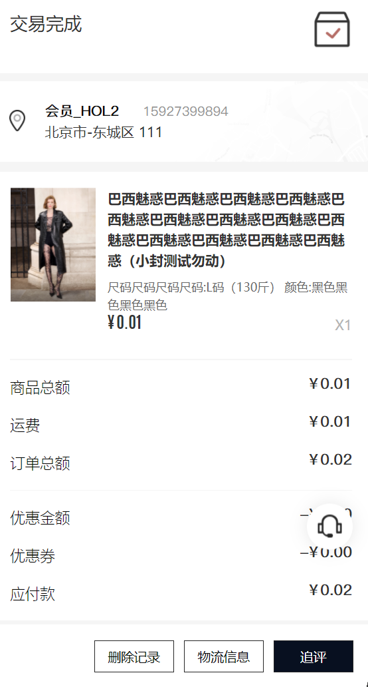
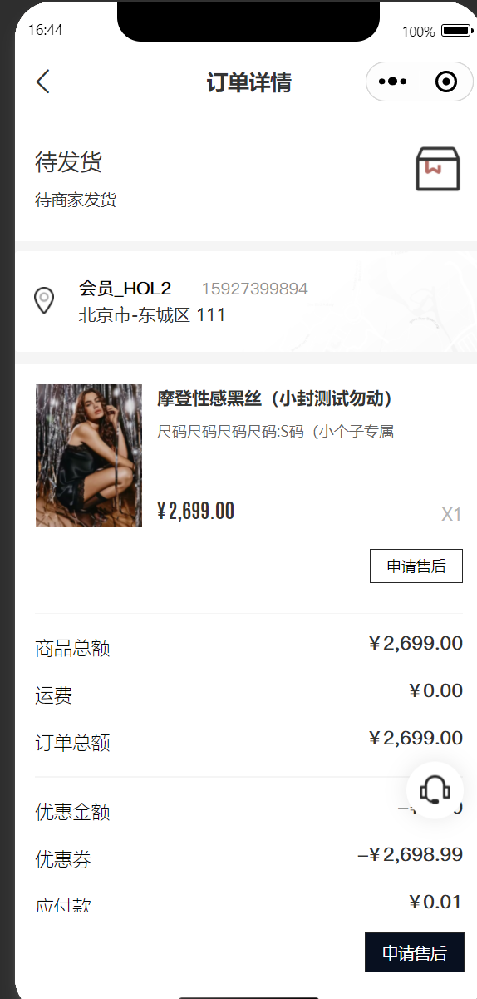

### 前端培训 2025-08-14


### **使用工具与框架**


- Umi max 后台脚手架，集成 antd 组件库，可快速搭建后台管理系统 
（link: https://umijs.org/docs/max/introduceant-design-pro）

- Ant Design UI组件库，提供了丰富的基础组件。
（link: https://ant.design/docs/react/introduce-cn）

- Pro Components  基于 antd 的一套高质量 React 组件库，提供了丰富的业务组件，适合中后台产品。
（link: https://procomponents.ant.design/components/table-cn）


- Ahooks   基于 react hooks 的一套工具库，提供丰富的 hooks 让你快速上手使用。
（link: https://ahooks.js.org/zh-CN/hooks/introduce）

- Fitten Code 是由 清华大学 博士团队开发的国产AI编程助手，核心开发成员来自清华大学，并推动了国产深度学习框架 计图 （Jittor）的开源工作。 ‌

（link: https://code.fittentech.com/）

#### **后台管理**

---

- **使用自定义 hooks 封装 UI 组件**

在后台管理开发中, 常用的弹窗/抽屉 组件状态管理可以抽离成通用 hooks 方法, 方便复用, 减少代码量, 提升开发效率。

```typescript

/** 页面 - 地址库 此页面中调用 useDrawerForm 自定义hooks */

...
import AddressAddDrawer from './add-drawer'

interface IAddressLibraryProps {}

const Component: FC<IAddressLibraryProps> = () => {
  /** 编辑/新增地址 */
  const { onAdd, onEdit, drawerFormProps } = useDrawerForm<AddressOutputDto>('地址')

  const tableColumns: ProColumns<AddressOutputDto>[] = [
    { title: '联系人', dataIndex: 'name' },
    // ....
  ]

  const columns: ProColumns<AddressOutputDto>[] = [...tableColumns.map((item) => ({ ...item, hideInSearch: true }))]

  const onRefresh = () => {
    actionRef.current?.reload()
  }

  const { request, actionRef, formRef } = useProTableRequest(api['/admin/mall/address/queryPage_GET'])

  return (
    <PageContainer>
      <ProTable
        formRef={formRef}
        actionRef={actionRef}
        columns={columns}
        request={request}
        rowKey="id"
        search={false}
        toolbar={{
          actions: [
            <Button key="add" type="primary" onClick={onAdd}>
              添加地址
            </Button>
          ]
        }}
      />
      {/* 新增/编辑地址 */}
      <AddressAddDrawer {...drawerFormProps} onRefresh={onRefresh} />
    </PageContainer>
  )
}

const AddressLibrary = memo(Component)
export default AddressLibrary
```

```typescript
import { sleep } from "@wmeimob/utils/src/sleep";
/** hooks - 弹窗表单hooks */
import { Form } from "antd";
import { FormInstance } from "antd/es/form/Form";
import { useState } from "react";

/**
 * DrawerForm 表单hooks
 * @returns
 */
export interface DrawerFormProps<T> {
  /** 表单实例 */
  form: FormInstance<T>;
  /** 表单标题 */
  title: string;
  /** 是否是查看详情 */
  isDetail: boolean;
  /** 表单弹窗是否可见 */
  open: boolean;
  /** 关闭弹窗 */
  onClose: () => void;
  /** 刷新表格 */
  onRefresh?: () => void;
  /** 详情 */
  detail?: T;
  /* 详情 */
  setDetail?: (detail: T) => void;
}

export interface UseDrawerFormProps<T> {
  /** DrawerForm 表单props */
  drawerFormProps: DrawerFormProps<T>;
  /** 表单赋值编辑 */
  onEdit: (record?: T) => void;
  /** 新增表单 */
  onAdd: () => void;
  /** 查看详情 */
  onDetail: (record?: T) => void;
  /** 复制 */
  onCopy: (record?: T) => void;
}
export function useDrawerForm<T>(drawerTitle = ""): UseDrawerFormProps<T> {
  /** 表单实例 */
  const [form] = Form.useForm();

  /** 表单弹窗是否可见 */
  const [open, setOpen] = useState(false);
  /** 表单标题 */
  const [title, setTitle] = useState("");
  const [detail, setDetail] = useState<T>();
  /** 是否是查看详情 */
  const [isDetail, setIsDetail] = useState(false);

  /** 表单赋值编辑 */
  const onEdit = (record?: T) => {
    setDetail(record);
    form.setFieldsValue(record);
    setTitle(`编辑${drawerTitle}`);
    setOpen(true);
  };

  /** 新增表单 */
  const onAdd = () => {
    form.resetFields();
    setTitle(`添加${drawerTitle}`);
    setOpen(true);
  };

  const onCopy = (record?: T) => {
    const params = { ...record, name: "", isCopy: true };
    setDetail(params);
    form.setFieldsValue(params);
    setTitle(`复制${drawerTitle}`);
    setOpen(true);
  };

  /** 查看详情 */
  const onDetail = (record?: T) => {
    setDetail(record);
    form.setFieldsValue(record);
    setIsDetail(true);
    setTitle(`${drawerTitle}详情`);
    setOpen(true);
  };

  /** 关闭弹窗 */
  const onClose = async () => {
    form.resetFields();
    setOpen(false);
    await sleep(500);
    setIsDetail(false);
    setDetail(undefined);
  };

  /** DrawerForm 表单props */
  const drawerFormProps = {
    form,
    isDetail,
    title,
    open,
    onClose,
    detail,
    setDetail,
  };

  return { onEdit, onAdd, onDetail, drawerFormProps, onCopy };
}
```

---

- **使用 userRef 配合 useImperativeHandle 暴露组件内部方法/状态**

在组件内部管理自身状态, 同样减少代码冗余, 可以在外部调用组件内部方法来管理状态。

```typescript

/**
 * 组件中, 使用useImperativeHandle 暴露内部方法
 * 外部调用组件内部方法来管理状态
 */
 */
import { FC, memo, forwardRef, useState, useImperativeHandle } from 'react'
import styles from './index.module.less'
import { Button, Flex, Modal, Typography } from 'antd'
import { ProColumns, ProTable } from '@ant-design/pro-components'

export interface ISendCouponModalAction {
  openModal: (data: any[]) => void
}

interface ISaveFailureTableProps {
  ref: any
}

const Component: FC<ISaveFailureTableProps> = forwardRef((props, ref) => {
  const [visible, setVisible] = useState(false)
  const [data, setData] = useState<any[]>([])

  const close = () => {
    setVisible(false)
  }

  useImperativeHandle(ref, () => ({
    openModal: (data: any[]) => {
      setData(data)
      setVisible(true)
    }
  }))

  const columns: ProColumns<any>[] = [
    { title: '商品编码', dataIndex: 'goodsNo', copyable: true },
  ]

  return (
    <Modal
      zIndex={99999}
      title="新增/编辑活动失败"
      width={1000}
      open={visible}
      onClose={close}
      onCancel={close}
      onOk={close}
      footer={
        <Flex justify="flex-end">
          <Button type="primary" onClick={close} style={{ marginLeft: 10 }}>
            确认
          </Button>
        </Flex>
      }
    >
      <Typography.Text>新增,/编辑活动失败,以下商品已参加其他活动~</Typography.Text>
      <ProTable
        scroll={{ x: 1000 }}
        columns={columns}
        dataSource={data}
        pagination={{ pageSize: 10 }}
        rowKey="id"
        search={false}
        toolBarRender={false}
      />
    </Modal>
  )
})

const SaveFailureTable = memo(Component)
export default SaveFailureTable
```

_调用示例_

```typescript

import SaveFailureTable, { ISendCouponModalAction } from '~/components/marketing/save-failure-table'

interface IClearanceActivitiesEditProps extends DrawerFormProps<ResActivityClearanceDetailDto> {}

const Component: FC<IClearanceActivitiesEditProps> = (props) => {
  // const {} = props

  const { title, open, onClose, form, isDetail, onRefresh, detail } = props

  const isEdit = Boolean(detail?.id) && !detail?.isCopy

  const failTableRef = useRef<ISendCouponModalAction>(null)

 const [onFinish] = useSuperLock(async (values) => {
    const params = { ...values }
     ...
    try {
     ...
    } catch (error) {
      if (error?.data?.data) {
        failTableRef.current?.openModal(error?.data?.data)
      }
    }
  })

  ...
  return (
    <>
      <DrawerForm
        form={form}
        readonly={isDetail}
        disabled={isDetail}
        title={title}
        open={open}
        width={1000}
        scrollToFirstError
        drawerProps={{ destroyOnClose: true, onClose }}
        onFinish={onFinish}
        submitter={defalutSubmitter(isDetail, '创建并添加商品')}
      >
        <ProCard bordered title="基础设置">
          <ProFormText name="id" hidden />
          <ProFormLimitInput
            name="name"
            label="活动名称"
            rules={[{ required: true, message: '请输入活动名称' }]}
            fieldProps={{ placeholder: '请输入活动名称' }}
            maxLength={20}
          />
        </ProCard>
      </DrawerForm>
      <SaveFailureTable ref={failTableRef} />
    </>
  )
}

const ClearanceActivitiesEdit = memo(Component)
export default ClearanceActivitiesEdit

```

---


- **声明枚举类型 适配 antd / pro-components 组件库**

提前定义好枚举类型, 在 table 字段显示, select 选择项中可直接使用, 语义清晰且便于维护.


```typescript
/**
 * 枚举文件
 */
export enum EHqCouponStatus {
  /** 已作废 */
  Void = 3,
  /** 生效中 */
  Valid = 1,
  /** 未生效 */
  NoValid = 0,
  /** 已过期 */
  Expired = 2,
}
export const MHqCouponStatus = {
  [EHqCouponStatus.Void]: "已作废",
  [EHqCouponStatus.Valid]: "生效中",
  [EHqCouponStatus.NoValid]: "未生效",
  [EHqCouponStatus.Expired]: "已过期",
};

export const OHqCouponStatus = [
  { value: EHqCouponStatus.Void, label: "已作废" },
  { value: EHqCouponStatus.Valid, label: "生效中" },
  { value: EHqCouponStatus.NoValid, label: "未生效" },
  { value: EHqCouponStatus.Expired, label: "已过期" },
];
```

_使用方法_

```typescript

     // 直接使用枚举类型 MHqCouponStatus, 根据valueEnum来赋值显示
 const tableColumns: ProColumns<MemCouponHqResVO>[] = [
    ...
    { title: '状态', dataIndex: 'status', hideInSearch: true, valueEnum: MHqCouponStatus }
    ]

     // 使用OHqCouponStatus来渲染select选择项
    <ProFormSelect label="优惠券状态" name="status" options={OHqCouponStatus} fieldProps={{ allowClear: false }} />
```

---

- **前端简单工厂模式设计**

往往再页面中,随着同数据状态的流转, 需要渲染不同的组件, 此处可以使用简单工厂模式设计, 提升代码的可读性与可维护性。

## 举例 卡索: taro-template/src/pages/order-pages/order-detail/index.tsx 中的 _ButtonGroup_ 组件



